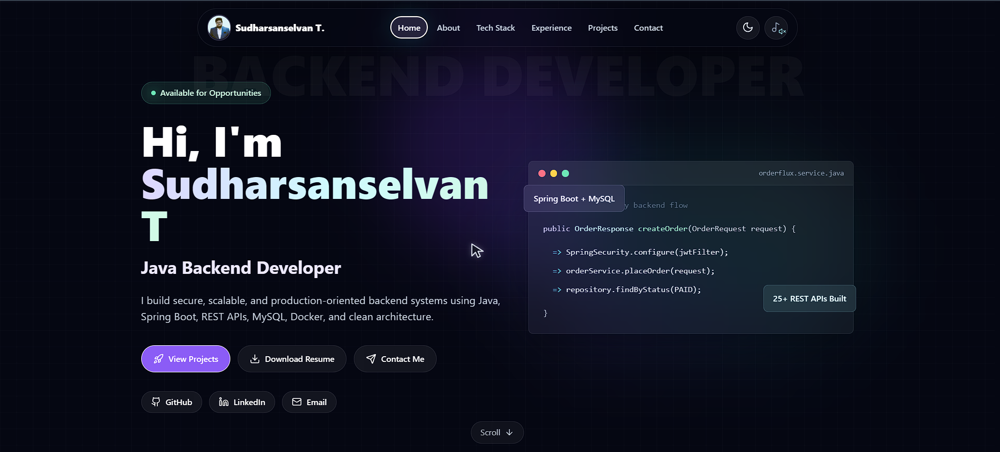

# 🚀 Sudharsanselvan — Developer Portfolio

<p align="center">
  
</p>

<p align="center">
  <a href="YOUR_LIVE_DEMO_LINK">
    
  </a>
  <a href="https://github.com/sudharselvan">
    
  </a>
  <a href="mailto:sudharselvan@gmail.com">
    
  </a>
</p>

---

## ✨ About This Portfolio

A modern, animated, and responsive developer portfolio built with **React**, showcasing my skills, projects, experience, and contact information as a **Java Backend Developer / Full Stack Developer**.

This portfolio focuses on clean UI, smooth animations, dark classic design, and a recruiter-friendly structure.

---

## 🔥 Features

- 🎨 Modern dark-themed UI
- ⚡ Smooth animations with Framer Motion
- 🧊 Glassmorphism cards and glowing effects
- 📱 Fully responsive design
- 🧭 Animated scroll-based navbar transformation
- 🛠️ Dynamic tech stack section
- 💼 Project showcase section
- 📩 Contact section with social links
- 🚀 Fast Vite-powered React setup

---

## 🛠️ Tech Stack

<p align="center">
  
</p>

### Frontend


### Backend Skills Highlighted


---

## 📌 Sections

- 🏠 Home
- 👨‍💻 About Me
- 🧰 Tech Stack
- 💼 Experience
- 🚀 Projects
- 📬 Contact

---

## 🚀 Featured Project

### 🛒 OrderFlux — E-Commerce Backend System

A production-oriented backend system built using **Java, Spring Boot, Spring Security, Hibernate/JPA, MySQL, Docker,** and **Swagger**. Implemented **JWT authentication**, Spring Security, **BCrypt password hashing**, **email OTP verification,** request validation and global exception handling.

#### Key Highlights

- 🔐 JWT Authentication
- 🔑 BCrypt Password Hashing
- 📦 Product Management APIs
- 🔎 Search, Filtering & Pagination
- 🛒 Order Workflow
- ✅ Request Validation
- 🧯 Global Exception Handling
- 📘 Swagger API Documentation
- 🧱 Layered Architecture

---

## 📂 Project Setup

### 1. Clone the repository

```bash
git clone https://github.com/sudharselvan/YOUR_REPO_NAME.git
```

### 2. Go to project folder

```bash
cd YOUR_REPO_NAME
```

### Install dependencies

```bash
npm install
```

### 4. Run locally

```bash
npm run dev
```

### 📸 Preview



### 📬 Contact Me

<p> <a href="mailto:sudharsanselvan13@gmail.com">  </a> </p> <p> <a href="https://github.com/sudharsanselvan">  </a> </p>
<p><a href="https://www.linkedin.com/in/sudharsanselvan">  </a> </p>
<p><a href="https://wa.me/916383015521"> 
</a></p>

### 👨‍💻 Author

Sudharsanselvan T.
Java Backend Developer | Spring Boot | REST APIs | MySQL | React

### ⭐ Support

If you like this portfolio, give this repository a ⭐ on GitHub.

<p align="center"> Built with ❤️ using React, Tailwind CSS, and Framer Motion </p>
